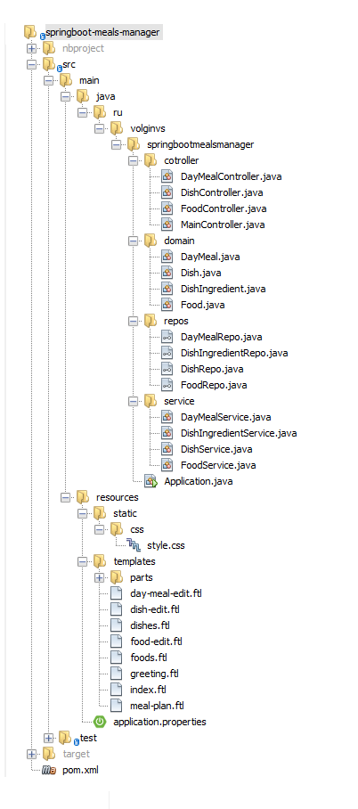

# Application for meals management
Hello, Guest!
----------
This is application for meals management 
The application is under development, however some features have already been implemented. 
Used stack of technologies:    
-Java 8  
-Spring Boot 2.1.7 
-Spring Data 2.1.7 
-PostgreSQL 
-JUnit 
-Freemarker 
-Maven 

How to use
----------
Download package and use Maven to deploy it on http://localhost:8080/

Project tree
----------

